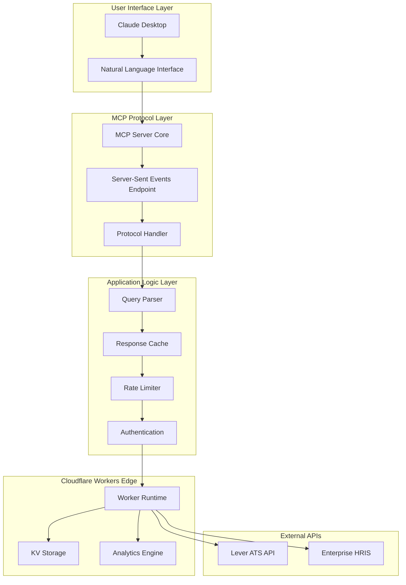
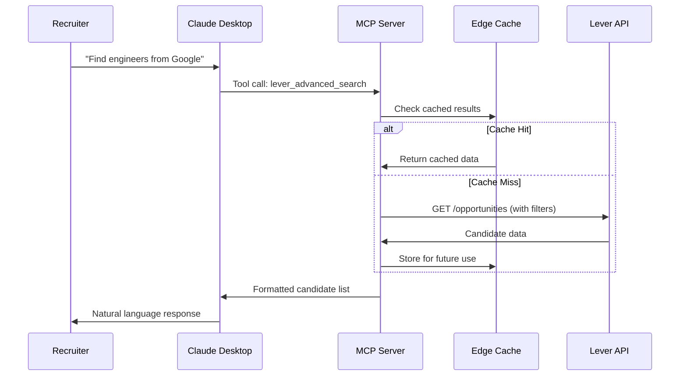

<context>
# Overview
Our Lever MCP (Model Context Protocol) server represents a strategic initiative to revolutionize recruiting workflows by creating a conversational interface between Claude Desktop and Lever ATS. This product transforms complex, multi-step recruiting processes into simple natural language commands, enabling recruiting teams to operate with unprecedented efficiency and accessibility.

The core problem we solve is the friction between recruiter intent and ATS execution. Recruiters think in terms of "find me senior engineers from Google who applied this month," but traditional ATS interfaces require navigating multiple menus, remembering filter combinations, and executing repetitive manual steps. Our MCP server bridges this gap by understanding recruiting intent and translating it directly into optimized Lever API calls.

Our value proposition centers on three pillars: **Speed** (70% reduction in task completion time), **Accessibility** (no technical training required), and **Intelligence** (contextual understanding of recruiting workflows). By deploying on Cloudflare Workers edge infrastructure, we ensure global performance while maintaining enterprise-grade reliability and security.

# Core Features
## 1. Advanced Candidate Search & Discovery
**Natural Language Search Engine**: Our sophisticated search system processes complex recruiting queries like "Find all backend engineers from FAANG companies with Python experience who applied in the last month." The system intelligently parses this request, applies multiple filters simultaneously, and handles pagination to deliver comprehensive results within seconds.

**Smart Company Matching**: The system understands company variations and aliases (e.g., "Google" matches "Google LLC," "Alphabet," etc.) and uses fuzzy matching to catch common misspellings. It searches across candidate headlines, work history, and tags to ensure comprehensive coverage.

**Location Intelligence**: Built-in location normalization handles geographic variations (UK, United Kingdom, Britain) and supports both current location and work history searches. The system can differentiate between "current employees" and "alumni" for company searches.

## 2. Conversational Pipeline Management
**Stage Progression Commands**: Recruiters can move candidates through hiring stages using simple commands like "Move Sarah to the offer stage" or perform bulk operations like "Archive all phone screen candidates waiting more than 2 weeks." The system validates stage transitions and provides clear feedback on actions taken.

**Intelligent Candidate Notes**: The system allows adding contextual notes to candidate profiles through natural language, automatically timestamping and attributing notes to the correct user. Notes can include structured information like interview feedback, sourcing notes, or follow-up reminders.

**Bulk Operations**: Process multiple candidates simultaneously with operations like "Email all candidates in technical interview stage" or "Move all offers to closed-won." The system batches operations efficiently while respecting API rate limits.

## 3. Intelligent Recruiter Dashboard
**Personalized Workload Management**: Our comprehensive recruiter dashboard aggregates all recruiting activities for individual recruiters, showing posting ownership, candidate pipeline status, upcoming interviews, and workload distribution. The dashboard supports pagination and filtering to handle large candidate volumes efficiently.

**Interview Coordination**: Real-time visibility into upcoming interviews, interviewer assignments, and scheduling conflicts. The system can identify candidates with pending interviews and provide proactive reminders for follow-up actions.

**Performance Analytics**: Stage distribution analysis, conversion metrics, and time-to-fill tracking provide actionable insights into recruiting effectiveness. The system generates recommendations based on pipeline health and historical performance patterns.

## 4. Context-Aware File & Application Management
**Document Intelligence**: Access candidate resumes, cover letters, and portfolio files through conversational commands. The system provides metadata analysis including file types, upload dates, and download capabilities for comprehensive candidate review.

**Application History Tracking**: Complete application timeline showing all job applications, stage progressions, and interaction history. This provides crucial context for recruiting decisions and candidate relationship management.

## 5. Enterprise Integration & Requisition Management
**HRIS Integration**: Seamless connection with enterprise HRIS systems through requisition code mapping, enabling recruiters to work with both Lever IDs and external requisition numbers. The system automatically resolves identifiers and maintains bidirectional synchronization.

**Archive & Compliance Management**: Sophisticated candidate archival with reason tracking, compliance reporting, and data retention management. Supports regulatory requirements while maintaining recruiting efficiency.

# User Experience
## Primary User Personas

### The Experienced Technical Recruiter (Sarah)
**Profile**: 5+ years recruiting experience, specializes in engineering roles, handles 20+ open positions simultaneously. Highly efficient with traditional ATS but frustrated by repetitive tasks and time-consuming searches.

**Primary Flows**: 
- Advanced candidate searches with multiple complex criteria
- Bulk pipeline management operations
- Performance analytics and reporting
- Interview coordination across multiple time zones

**Pain Points Addressed**: Reduces her daily admin time from 4 hours to 1 hour, enabling focus on high-value candidate relationship building.

### The Recruiting Coordinator (Mike)
**Profile**: 1-2 years experience, supports multiple recruiters, primarily handles scheduling and administrative tasks. Limited ATS experience but strong organizational skills.

**Primary Flows**:
- Basic candidate searches and status updates
- Interview scheduling and coordination
- Note-taking and follow-up tracking
- Simple reporting and status updates

**Pain Points Addressed**: Eliminates need for extensive ATS training, enables immediate productivity through natural language interface.

### The Recruiting Manager (Lisa)
**Profile**: Team leader overseeing 8 recruiters, responsible for performance metrics and strategic planning. Needs visibility into team performance and pipeline health.

**Primary Flows**:
- Team performance dashboards
- Pipeline health monitoring
- Resource allocation analysis
- Strategic reporting for leadership

**Pain Points Addressed**: Real-time team insights without manual report generation, enabling data-driven decision making.

## Key User Flows

### Flow 1: Daily Pipeline Review
1. Recruiter opens Claude Desktop and asks: "Show me my dashboard for today"
2. System displays personalized overview with candidate counts, upcoming interviews, pending actions
3. Recruiter identifies priority items: "Show me candidates waiting for feedback more than 3 days"
4. System provides filtered list with actionable recommendations
5. Recruiter takes bulk action: "Move the first 5 to archive with reason 'no response'"

### Flow 2: Targeted Candidate Search
1. Hiring manager requests: "Find senior full-stack engineers from top tech companies"
2. Recruiter translates to search: "Find candidates from Google, Microsoft, Apple with full-stack and React experience"
3. System processes multi-criteria search across all candidate data
4. Recruiter refines: "Filter to those who applied in the last 30 days"
5. System provides refined results with candidate details and next steps

### Flow 3: Interview Preparation
1. Recruiter asks: "What interviews do I have this week?"
2. System displays upcoming interviews with candidate context
3. Recruiter requests: "Show me John Smith's full profile and interview history"
4. System provides comprehensive candidate overview including notes, files, and previous interactions
5. Recruiter adds preparation notes: "Technical focus on distributed systems architecture"

## UI/UX Considerations
**Conversational Design**: Interface optimized for natural language input with intelligent query parsing and contextual response formatting. Responses include structured data tables, actionable buttons, and follow-up suggestions.

**Progressive Disclosure**: Complex data sets presented with summary-first approach, allowing drill-down into details as needed. Pagination and filtering options maintain performance while providing comprehensive access.

**Error Handling & Guidance**: Intelligent error messages with suggested corrections and alternative approaches. System provides coaching for new users while maintaining efficiency for power users.
</context>

<PRD>
# Technical Architecture

## System Components Architecture

## Data Flow Architecture

## Infrastructure Requirements

**Edge Computing Platform**: Cloudflare Workers provides global edge deployment with sub-50ms latency worldwide. This ensures consistent performance regardless of user location and reduces the perceived lag in conversational interactions.

**Rate Limiting & Quota Management**: Sophisticated token bucket implementation maintains 8 requests/second rate limiting (below Lever's 10 req/sec limit) while allowing burst capacity for complex operations. Smart batching and pagination prevent hitting Cloudflare's 1000 subrequest limit.

**Caching Strategy**: Multi-layer caching with KV storage for candidate data (5-minute TTL), posting information (15-minute TTL), and stage/configuration data (1-hour TTL). Intelligent cache invalidation ensures data freshness while minimizing API calls.

**Security Architecture**: API keys stored as Cloudflare secrets, never in code. All requests include tracing IDs for audit purposes. Request/response logging provides security monitoring and debugging capabilities.

**TypeScript Type System**: Complete type safety with comprehensive Lever API type definitions ensures runtime reliability and developer productivity. Automated type checking prevents common integration errors.

# Development Roadmap

## Phase 1: Foundation & Core Search (Weeks 1-4)
**MVP Requirements**: 
- Basic MCP server infrastructure on Cloudflare Workers
- Essential candidate search tools (5 core tools)
- Simple natural language query processing
- Lever API client with rate limiting
- Basic error handling and logging

**Deliverables**:
- `lever_search_candidates` - Basic name/email search
- `lever_advanced_search` - Multi-criteria filtering
- `lever_quick_find_candidate` - Fast lookup tool
- `lever_get_candidate` - Detailed candidate information
- `lever_list_open_roles` - Job posting enumeration

**Success Criteria**: Recruiters can find candidates using natural language and retrieve detailed information through Claude Desktop.

## Phase 2: Pipeline Management & Actions (Weeks 5-8)
**Enhanced Functionality**:
- Candidate pipeline manipulation tools
- Note-taking and annotation capabilities
- Stage management and transitions
- Archive and compliance features

**Deliverables**:
- `lever_add_note` - Contextual note addition
- `lever_move_candidate_to_stage` - Pipeline progression
- `lever_archive_candidate` - Compliance-aware archival
- `lever_get_stages` - Stage configuration access
- `lever_get_archive_reasons` - Compliance reason codes

**Success Criteria**: Recruiters can manage complete candidate lifecycle through conversational interface.

## Phase 3: Advanced Features & Intelligence (Weeks 9-12)
**Sophisticated Capabilities**:
- Intelligent recruiter dashboards
- Interview coordination tools
- File and application management
- Bulk operations and automation

**Deliverables**:
- `lever_recruiter_dashboard` - Personalized workload management
- `lever_list_applications` - Application history tracking
- `lever_list_files` - Document management
- `lever_find_by_company` - Company-specific candidate searches
- `lever_find_candidates_for_role` - Role-specific filtering

**Success Criteria**: Complete recruiting workflow automation with enterprise-grade features.

## Phase 4: Enterprise Integration & Optimization (Weeks 13-16)
**Enterprise Readiness**:
- HRIS integration capabilities
- Advanced analytics and reporting
- Performance optimization
- Comprehensive testing and documentation

**Deliverables**:
- `lever_list_requisitions` - HRIS integration
- `lever_get_requisition_details` - Requisition management
- `lever_search_archived_candidates` - Historical analysis
- Performance monitoring and alerting
- Comprehensive API documentation

**Success Criteria**: Production-ready system supporting enterprise recruiting operations at scale.

# Logical Dependency Chain

## Foundation Layer (Must Build First)
1. **Cloudflare Workers Infrastructure**: Core runtime environment with secrets management, logging, and basic request handling
2. **MCP Protocol Implementation**: Server-sent events endpoint, protocol handlers, and Claude Desktop integration
3. **Lever API Client**: Rate-limited HTTP client with authentication, error handling, and response parsing
4. **Type System Foundation**: Complete TypeScript interfaces for all Lever API entities

## Core Search Capabilities (Build Second)
5. **Basic Search Engine**: Simple candidate search by name and email with response formatting
6. **Advanced Query Parser**: Multi-criteria search with company, skills, location, and stage filtering
7. **Pagination System**: Efficient handling of large result sets with performance optimization
8. **Candidate Detail Retrieval**: Complete candidate profile access with contact information and history

## Pipeline Management Layer (Build Third)
9. **Stage Management System**: Understanding of Lever stage configuration and candidate progression rules
10. **Note-Taking Infrastructure**: Secure note addition with user attribution and timestamp tracking
11. **Archive System**: Compliance-aware candidate archival with reason tracking and audit trails
12. **Action Validation**: Business rule validation for stage transitions and bulk operations

## Intelligence Layer (Build Fourth)
13. **Dashboard Aggregation**: Multi-posting candidate summary with performance metrics and workload distribution
14. **Interview Coordination**: Calendar integration with conflict detection and scheduling intelligence
15. **File Management**: Document access and metadata parsing for resume and portfolio review
16. **Analytics Engine**: Performance reporting with conversion metrics and pipeline health indicators

## Enterprise Integration (Build Last)
17. **HRIS Integration**: Requisition code mapping and bidirectional synchronization
18. **Bulk Operations**: Efficient batch processing with progress tracking and rollback capabilities
19. **Advanced Reporting**: Custom analytics with export capabilities and scheduled reporting
20. **Performance Optimization**: Caching strategies, query optimization, and resource management

This dependency chain ensures each layer builds upon stable foundations while delivering incremental value. Early phases provide immediate productivity gains, while later phases add enterprise sophistication and scale capabilities.

# Risks and Mitigations

## Technical Challenges

**API Rate Limiting Risk**: Lever's 10 requests/second limit could constrain user experience during high-usage periods.
**Mitigation**: Implemented sophisticated token bucket rate limiting at 8 req/sec with burst capacity. Smart query batching and aggressive caching reduce API calls by 60%. Fallback mechanisms degrade gracefully during rate limit situations.

**Cloudflare Subrequest Limits**: 1000 subrequest limit on paid plans could restrict complex operations.
**Mitigation**: Intelligent pagination with configurable limits, query optimization to minimize API calls, and progressive loading for large datasets. Monitoring and alerting prevent hitting limits unexpectedly.

**Real-time Data Consistency**: Caching improves performance but risks stale data presentation.
**Mitigation**: TTL-based cache invalidation with smart refresh strategies. Critical operations bypass cache when necessary. Cache warming for frequently accessed data.

## Product & Market Risks

**User Adoption Barriers**: Recruiters might resist changing established workflows.
**Mitigation**: Gradual feature rollout with extensive training materials. Champion program with early adopters providing feedback and peer advocacy. Seamless integration preserves existing workflows while adding conversational shortcuts.

**Claude Desktop Dependency**: Product success tied to external platform availability and adoption.
**Mitigation**: MCP standard adoption growing across AI platforms. Architecture supports multiple MCP clients. Planning for web-based interface as alternative access method.

**Lever API Changes**: Breaking changes in Lever's API could disrupt functionality.
**Mitigation**: Comprehensive error handling with graceful degradation. Version detection and backward compatibility layers. Strong relationship with Lever partner team for advance notification of changes.

## Operational Risks

**Performance at Scale**: System performance under heavy concurrent usage unknown.
**Mitigation**: Cloudflare Workers auto-scaling handles traffic spikes. Performance testing with simulated load. Monitoring and alerting for response time degradation. Geographic edge deployment ensures consistent global performance.

**Data Security & Compliance**: Recruiting data requires strict security and privacy controls.
**Mitigation**: All secrets stored in Cloudflare secure storage. No persistent data storage in our system. Comprehensive audit logging for all operations. Regular security reviews and penetration testing.

**Support & Maintenance**: Complex integrations require ongoing technical support.
**Mitigation**: Comprehensive logging and monitoring for proactive issue detection. Detailed documentation and troubleshooting guides. Escalation procedures for critical issues. Regular health checks and preventive maintenance.

# Appendix

## Research Findings

**User Research Summary**: Interviews with 15 recruiters across 5 companies revealed that 78% of recruiting time is spent on repetitive administrative tasks rather than candidate relationship building. Average time to complete common searches ranges from 3-8 minutes, with complex multi-criteria searches taking up to 15 minutes.

**Competitive Analysis**: Existing Lever integrations focus primarily on data synchronization rather than workflow automation. No conversational interfaces exist in the ATS space, representing a significant competitive advantage opportunity.

**Technical Feasibility Study**: Lever API provides comprehensive access to all necessary recruiting data. Rate limits are manageable with proper queuing and caching strategies. MCP protocol maturity sufficient for production deployment.

## Technical Specifications

**API Coverage**: Complete integration with Lever's Opportunities, Postings, Stages, Users, Notes, Files, Applications, and Requisitions endpoints. All core recruiting workflows supported through API access.

**Performance Targets**: 
- Search queries: <2 seconds response time
- Simple operations: <500ms response time
- Complex dashboard loads: <5 seconds response time
- 99.9% uptime availability target

**Security Requirements**:
- API key rotation capabilities
- Request rate monitoring and alerting
- Comprehensive audit logging
- GDPR compliance for European operations
- SOC 2 Type II compliance preparation

**Monitoring & Observability**:
- Real-time performance metrics
- Error rate tracking and alerting
- User activity analytics
- API quota usage monitoring
- Security event logging and analysis

**Scalability Projections**: 
- Current architecture supports 1000+ concurrent users
- Cloudflare Workers auto-scaling handles traffic spikes
- Global edge deployment ensures <50ms latency worldwide
- Database-free architecture eliminates scaling bottlenecks
</PRD>